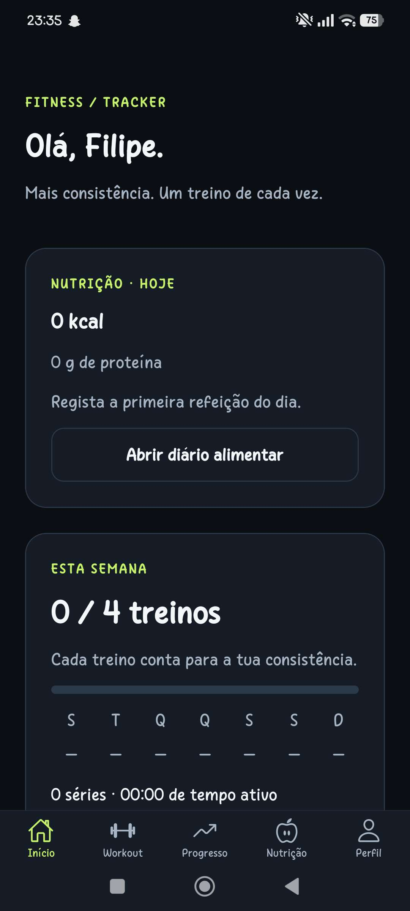
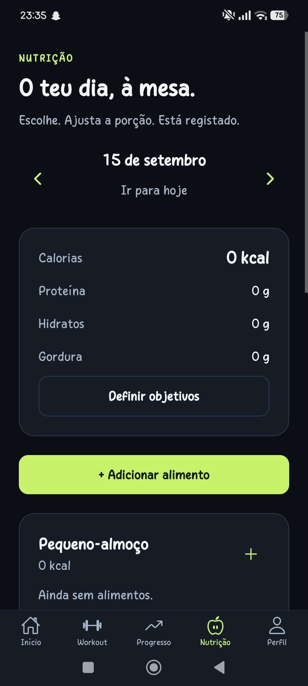
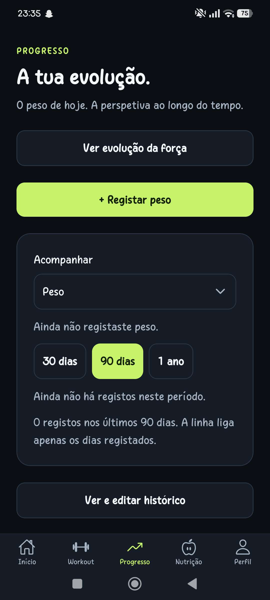
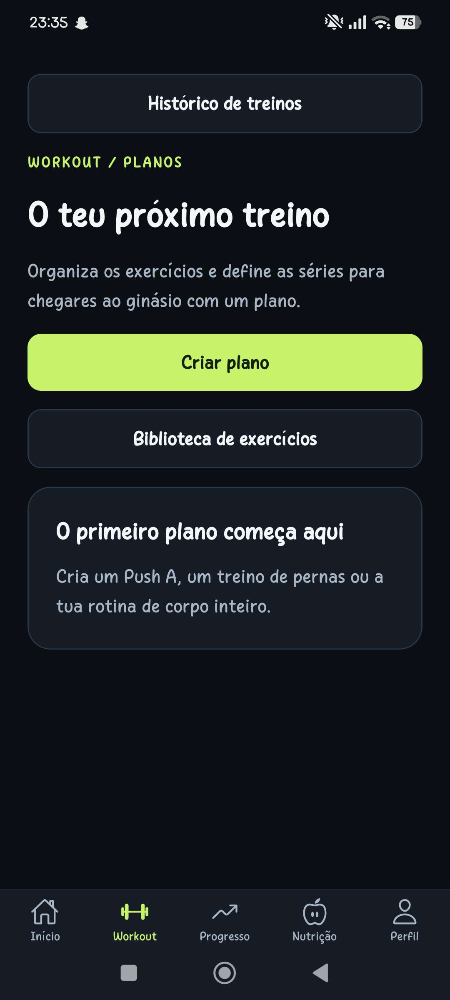
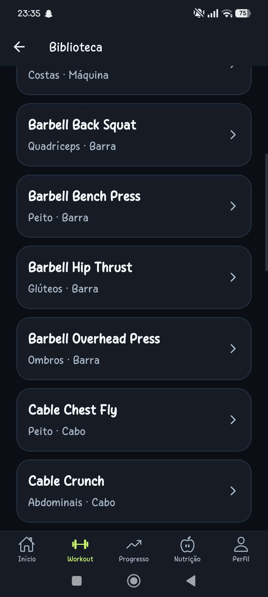
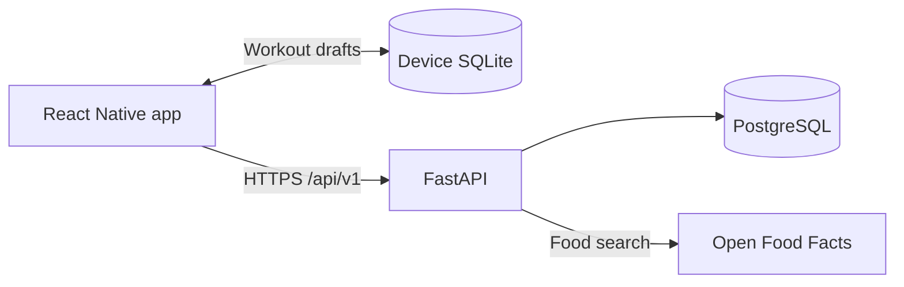

# Fitness Tracker

A mobile app for strength training, nutrition and personal progress. Plan your
workouts, log sets even when the connection drops, and track your habits over time.
Built with React Native, Expo, TypeScript, FastAPI and PostgreSQL.

**Android release available · API deployed · MIT licensed**

[Download Android APK](https://expo.dev/artifacts/eas/mPO6dddmeKd-IrB6CpaMe0ebkzlz3hpnfxSqXFXz7OM.apk)
· [Screenshots](#screenshots)
· [Local setup](#local-development)
· [Documentation](#documentation)

## Screenshots

Current Android screenshots supplied by the project owner after installing the
0.1.0 release. The app interface is in Portuguese; these captures show the initial
account state. Typography reflects the device's system font settings.

<table>
  <tr>
    <th>Home</th>
    <th>Nutrition</th>
    <th>Progress</th>
  </tr>
  <tr>
    <td></td>
    <td></td>
    <td></td>
  </tr>
</table>

<details>
<summary>Workout planning and exercise library</summary>

<table>
  <tr>
    <th>Workout plans</th>
    <th>Exercise library</th>
  </tr>
  <tr>
    <td></td>
    <td></td>
  </tr>
</table>

</details>

## Features

- **Workout planning:** 24 starter exercises, muscle and equipment filters,
  favorites, custom exercises and reusable plans with configurable sets.
- **Workout logging:** weight, repetitions, reps in reserve (RIR), warm-up and
  working sets, rest timers, pause/resume and exercise substitutions.
- **Offline workout recovery:** active sessions stored in SQLite, recovery after
  closing the app, and synchronization when the connection returns.
- **History and records:** session summaries, training volume, personal records
  and a weekly dashboard based on completed workouts.
- **Nutrition with less typing:** Open Food Facts search fills calories and macros;
  recent foods, favorites, quick portions and meal copying speed up daily logging.
- **Body and strength progress:** weight and body measurements, charts, estimated
  one-rep max, exercise records and comparisons between sessions.
- **Progression suggestions:** use the previous session to suggest repetitions or
  load, fill remaining sets, and undo the change.

## Try it on Android

1. Download the **0.1.0 APK (versionCode 2)** using the link above.
2. Open the file from Downloads and install it on your Android phone.
3. Create an account, then create a workout plan or add your first food entry.

The APK includes the JavaScript bundle and works without Expo Go, Metro or a PC.
Authentication, loading server data and synchronization require Internet access;
a workout started online can continue recording sets offline.

The hosted database is separate from local development. Local accounts and records
are not transferred automatically. There is no shared demo account or default password.

The API runs on Render Free with PostgreSQL on Neon Free. After inactivity, the
first request may take longer while the service wakes up; the APK allows up to
90 seconds per request. Free service quotas apply.

[Expo build](https://expo.dev/accounts/nerifilipe/projects/fitness-tracker/builds/07348244-3818-4517-89be-3985a2fa6a7b)
· [API health](https://fitness-tracker-api-ku46.onrender.com/api/v1/health)
· [Deployment and updates](docs/milestone-12.md)

## Technology and architecture

| Layer | Implementation |
| --- | --- |
| Mobile | Expo SDK 57, React Native 0.86, React 19, TypeScript 6 |
| Navigation and storage | React Navigation, SQLite, SecureStore |
| API | FastAPI, Pydantic, SQLAlchemy 2, psycopg 3 |
| Database | PostgreSQL 17, Alembic migrations |
| Authentication | Argon2 passwords, short-lived JWT access tokens, rotating refresh tokens |
| Testing | pytest, Vitest, Ruff, TypeScript checks |
| Delivery | Docker, Render, Neon and Expo EAS |



The backend is a modular monolith. Routers validate requests and ownership;
services coordinate business rules and transactions. OpenAPI generates the mobile
API types. Workout writes use versions and idempotency receipts to handle retries
and conflicts, while historical snapshots preserve past sessions after plan edits.
Refresh credentials are stored in SecureStore; access tokens remain in memory.

```text
mobile/                   Expo app, feature modules and mobile tests
backend/app/modules/      Auth, users, exercises, templates, workouts, nutrition, progress
backend/migrations/       Database migrations 0001–0006
backend/scripts/          Local setup, seed, OpenAPI export and deployment checks
docs/                     Design decisions, data model, milestones and screenshots
compose.yaml              Local PostgreSQL
compose.release-test.yaml Isolated deployment test environment
render.yaml               Hosting configuration
```

## Local development

The commands below use **PowerShell**, starting at the repository root.
Requirements: Node.js 22.13+, Python 3.12+, Docker Desktop with its Linux engine
running, and Expo Go compatible with SDK 57 or a development build.

### Backend

```powershell
docker compose up -d db
python -m venv backend/.venv
backend/.venv/Scripts/python -m pip install -r backend/requirements.lock
backend/.venv/Scripts/python -m pip install --no-deps -e backend
if (!(Test-Path backend/.env)) { Copy-Item backend/.env.example backend/.env }
backend/.venv/Scripts/python backend/scripts/setup_local.py
backend/.venv/Scripts/python -m alembic -c backend/alembic.ini upgrade head
backend/.venv/Scripts/python backend/scripts/seed_exercises.py
cd backend
.venv/Scripts/python -m uvicorn app.main:app --reload --host 0.0.0.0 --port 8000
```

Open [local API documentation](http://localhost:8000/docs). `/api/v1/health` checks
the API process; `/api/v1/ready` also checks PostgreSQL and returns 503 if unavailable.
The seed adds 24 exercises and 10 muscle groups without duplicating existing data.
`setup_local.py` generates `JWT_SECRET` only if missing; preserve it between restarts.
The Compose credentials are for local development only.

### Mobile

In a second terminal, from the repository root:

```powershell
cd mobile
npm ci
if (!(Test-Path .env)) { Copy-Item .env.example .env }
```

Set `EXPO_PUBLIC_API_URL` in `mobile/.env` to `http://<PC-IPv4>:8000/api/v1`.
Use the same network on the phone and PC, and allow port 8000 on the private network.
The Android emulator uses `10.0.2.2`; the iOS simulator uses `localhost`.
Then start Expo from `mobile`:

```powershell
npm start
```

Restart Expo after changing environment variables. Never put credentials in
`EXPO_PUBLIC_*`. First login and initial workout creation need a connection;
cached identity and SQLite allow an existing workout to recover offline.
Cached identity does not bypass server authentication.

Stop PostgreSQL with `docker compose stop db` from the root to preserve local data.
Do not use `down -v` if you want to keep the database volume. Stop the API and Metro
with Ctrl+C.

## Verification

With local PostgreSQL available, run from the repository root:

```powershell
backend/.venv/Scripts/python -m pytest backend/tests -q
backend/.venv/Scripts/python -m ruff check backend
backend/.venv/Scripts/python -m alembic -c backend/alembic.ini check
cd mobile
npm run typecheck
npm test
npx expo install --check
npx expo export --platform android --platform ios
```

Backend tests create and remove an isolated `test_auth_<uuid>` schema.
`TEST_DATABASE_URL` can select a separate test database. The mobile integration
test starts its own local API and uses real SQLite storage through a Node adapter;
it requires Node on PATH and the mobile dependencies installed. Run it separately
from the root with:

```powershell
backend/.venv/Scripts/python -m pytest backend/tests/test_mobile_integration.py -q
```

The normal `npm test` skips that integration scenario because it needs the Python
harness. The full backend suite includes it. Do not point the integration harness
at a personal or hosted API.

The deployed API passed health, database readiness and unauthenticated-access
checks. The APK was built and inspected, and the project owner confirmed installation
and use on Android. Detailed manual coverage of all screens, accessibility and
release offline scenarios remains incomplete; iOS device testing and store
publication are not part of this release. Exporting bundles does not replace
device testing. See the milestone reports for the checks performed at each stage.

<details>
<summary>Manual workout checks</summary>

1. Register, update the profile, reopen the app, sign out and sign back in. Check
   invalid credentials, duplicate email, larger text, keyboard and network loss.
   Logout requires a connection to revoke the session; failure keeps the session
   available for another attempt.
2. Search the exercise library, filter by muscle/equipment, favorite an exercise,
   and create, edit and archive a custom exercise. Check isolation between accounts.
3. Create a plan, configure sets, reps, weight, rest and optional RIR, then reorder,
   duplicate and edit it. Confirm changes to a copy do not change the original.
4. Start a workout, complete sets, pause/resume and reopen the app. Disconnect,
   record another set, reopen, reconnect and synchronize. The rest timer does not
   send notifications while the app is closed.
5. Finish a workout offline, then synchronize and inspect its summary and history.
   Unfinished sets should be excluded from results. History and summaries need a
   connection; failed loading must not appear as an empty result.

</details>

## Updating the API contract

From the repository root:

```powershell
backend/.venv/Scripts/python backend/scripts/export_openapi.py
cd mobile
npm run api:types
npm run typecheck
```

Commit `docs/openapi.json` and `mobile/src/services/api/schema.d.ts` together.
The generator uses OpenAPI TypeScript 7.13 with TypeScript 5.9 in an isolated npm
execution; the app uses TypeScript 6. Contract generation needs neither a running
API nor a database. Dependency resolutions are pinned in `mobile/package-lock.json`
and `backend/requirements.lock`.

## Documentation

Implementation reports and detailed design notes are currently in Portuguese.

| Topic | Guide |
| --- | --- |
| Architecture, navigation and milestones | [Architecture](docs/architecture.md) |
| Tables, relationships and constraints | [Data model](docs/database.md) |
| Foundation and authentication | [M1](docs/milestone-1.md) · [M2](docs/milestone-2.md) |
| Exercise library and plans | [M3](docs/milestone-3.md) · [M4](docs/milestone-4.md) |
| Workout recovery, history and validation | [M5](docs/milestone-5.md) · [M6](docs/milestone-6.md) · [M7](docs/milestone-7.md) |
| Nutrition and body measurements | [M8](docs/milestone-8.md) · [M9](docs/milestone-9.md) |
| Strength trends and progression suggestions | [M10](docs/milestone-10.md) · [M11](docs/milestone-11.md) |
| Hosted API, Android APK and maintenance | [M12](docs/milestone-12.md) |

## License and food data

Source code is available under the [MIT License](LICENSE).
Food search uses Open Food Facts. Imported food data has its own licensing and
attribution requirements, documented in the [nutrition guide](docs/milestone-8.md#fonte-e-disponibilidade).
