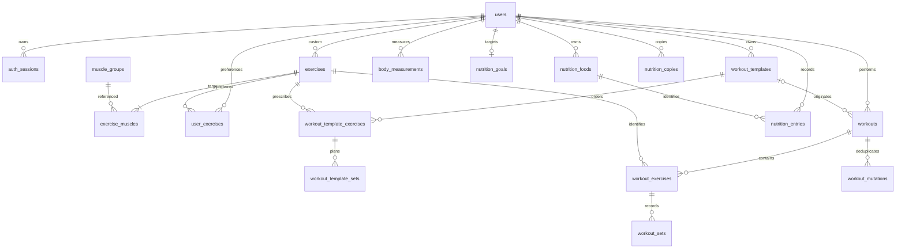

# Modelo de dados

Estado M12: identidade, biblioteca, planos e treinos nas migrações 0001–0004,
nutrição em 0005 e medidas corporais em 0006. Histórico, PRs, dashboard, evolução
da força e sugestões usam os dados existentes, sem tabelas adicionais de métricas.
O Neon publicado foi verificado na revisão `0006_progress`.
Favoritos false removem a linha de user_exercises; o flag existe para
evoluir preferências sem duplicar exercícios. Catálogo/privados são diferenciados por owner_id.

As chaves são UUID ou compostas, conforme indicado; datas de criação/alteração usam
timestamptz quando presentes. FKs são indexadas quando usadas em joins/filtros. Numeric para
carga/medidas/macros; nunca float para persistência. Constraints CHECK de valores não negativos,
reps inteiras positivas quando concluídas, RIR inteiro 0–10 e posições >=0.

## V1

| Tabela | Campos e constraints principais |
|---|---|
| users | id, email (índice único lower(email)), password_hash, display_name, timezone, unit_system, weekly_workout_target >0 |
| auth_sessions | id, user_id FK, refresh_token_hash UNIQUE, family_id, expires_at, revoked_at, replaced_by_id FK nullable |
| muscle_groups | id, slug UNIQUE, name |
| exercises | id, owner_id FK users nullable = catálogo global, name, equipment, load_type, load_convention, instructions nullable, archived_at |
| exercise_muscles | exercise_id FK, muscle_group_id FK, role primary/secondary; PK (exercise_id,muscle_group_id), índice único parcial exercise_id WHERE role='primary' |
| user_exercises | user_id FK, exercise_id FK, is_favorite; PK (user_id,exercise_id) — preferências, não duplicação do exercício |
| workout_templates | id, user_id FK, name, version >0, archived_at |
| workout_template_exercises | id, template_id FK, exercise_id FK, position, rest_seconds >=0, notes; UNIQUE(template_id,position) |
| workout_template_sets | id, template_exercise_id FK, position, set_type, target_reps_min/max, target_weight_kg nullable, target_rir nullable; UNIQUE(template_exercise_id,position) |
| workouts | id (cliente), user_id FK, template_id FK nullable, create_hash, name_snapshot, status active/paused/completed/cancelled, started_at, finished_at nullable, paused_at nullable, paused_seconds >=0, rest_deadline nullable, notes, version |
| workout_exercises | id, workout_id FK, exercise_id FK, position, name_snapshot, load_type_snapshot, load_convention_snapshot, rest_seconds, notes; UNIQUE(workout_id,position) |
| workout_sets | id, workout_exercise_id FK, position, set_type warmup/working, weight_kg numeric(8,3) nullable, reps nullable, rir nullable, completed_at nullable; UNIQUE(workout_exercise_id,position) |
| workout_mutations | workout_id FK CASCADE, mutation_id; PK composta; payload_hash, applied_version — recibo de idempotência |

Um exercício pode repetir-se num template/sessão: não impor UNIQUE(workout_id,exercise_id).
A tabela de sets planeados é necessária para distinguir prescrição de resultado real.
Em M4, guardar substitui os filhos do plano numa única transação: os UUIDs dos exercícios
planeados/séries são internos e regenerados na edição; estes filhos não têm timestamps
próprios. `workout_templates.updated_at/version` identificam a revisão do agregado.
PUT e DELETE exigem a versão lida e usam lock de linha; uma versão antiga devolve 409.
Limites atuais: 40 exercícios por plano, 1–20 séries por exercício, descanso 0–3600 s,
reps 1–999 com máximo >= mínimo, carga numeric(8,3) opcional, RIR opcional 0–10.
Planos vazios são permitidos. Apagar arquiva e preserva filhos; não existe restauro na UI.
Não guardar is_custom: deriva de owner_id. Exigir exatamente um músculo primário no serviço
(índice parcial só garante no máximo um). Catálogo global é apenas editável pelo administrador.

Índices: workouts(user_id,started_at DESC,id), workout_templates(user_id),
exercises(owner_id,lower(name)), exercise_muscles(muscle_group_id,exercise_id),
auth_sessions(user_id,expires_at). Índice UNIQUE parcial workouts(user_id) WHERE status IN
('active','paused'). CHECK: completed exige finished_at >= started_at; completed_at num set
exige reps e weight válidos segundo load_type. Regras entre tabelas são validadas no serviço
dentro de transação. Posição reordenada atomicamente com UNIQUE deferrable.

PRs, duração ativa e volume são derivados de sets/sessões concluídos; sem tabela duplicada
de records inicialmente. Consultar record anterior excluindo a sessão atual. Para PRs recentes,
comparar cronologicamente com o máximo anterior. Materializar só após medir desempenho.

M6 considera apenas `status=completed` nas consultas de histórico/dashboard/PRs.
A finalização reutiliza `workout_mutations`, lock e versão do PUT; exige pelo menos uma
série concluída e fecha o treino para novas alterações. O replay exato continua permitido.
PRs são agrupados por exercise_id e convenção snapshot; repetições também pela carga
decimal exata. Séries de aquecimento/incompletas, peso corporal e assistência não geram
PRs nem volume externo. Valores por mão não são multiplicados por dois.
Ordenação cronológica usa (started_at,id); limites diários/semanais respeitam timezone
IANA e mudanças de hora. Ver milestone-6.md para as regras completas.

## M9 — progresso corporal implementado

| Tabela | Campos |
|---|---|
| body_measurements | PK (user_id FK, date), weight_kg, waist_cm, chest_cm, arms_cm, legs_cm numeric(7,3), notes varchar(500), created_at, updated_at; pelo menos uma medida |

A chave primária permite um registo por dia/conta e suporta consultas por data.
As datas representam o dia escolhido pelo utilizador no fuso do perfil; guardar no
mesmo dia atualiza esse registo. A remoção do utilizador propaga-se às suas medidas.
O backend guarda kg/cm; a interface converte para lb/in quando escolhido no perfil.
O gráfico consulta os registos sem preencher dias ausentes. Ver milestone-9.md.

Fotografias e percentagem de gordura ficam planeadas para uma fase posterior. Uma
futura tabela `progress_photos` poderá ligar à medição pela mesma conta/data, com
object_key único, instante e vista. Analytics de força, frequência, e1RM e volume
continuam a consultar o histórico V1; não se cria uma tabela por gráfico.

## M8 — nutrição implementada

| Tabela | Campos |
|---|---|
| nutrition_foods | id UUID, user_id FK, source_code nullable, snapshot JSONB, is_favorite, last_quantity numeric(12,3), last_used_at, created_at; UNIQUE(user_id,source_code) |
| nutrition_entries | id UUID do cliente, user_id FK, food_id FK, date, meal breakfast/lunch/dinner/snack, quantity numeric(12,3) >0 e <=10000, snapshot JSONB, deleted, created_at, updated_at |
| nutrition_goals | PK user_id FK, targets JSONB, updated_at; objetivos atuais por conta |
| nutrition_copies | PK (user_id FK,id UUID), request JSONB, created_at; recibo de cópia idempotente |

Os alimentos pertencem à biblioteca de cada conta, incluindo os importados do Open
Food Facts. Favoritos e última quantidade ficam no próprio alimento. Os registos
preservam snapshots nutricionais; editar a biblioteca não altera o diário passado.
Índices por (user_id,last_used_at) e (user_id,date) suportam recentes e diário.
Não existem tabelas separadas de refeições ou favoritos: a refeição é um campo do
registo e a repetição de outro dia usa recibos de cópia. Os objetivos atuais também
aparecem nos dias anteriores; histórico de objetivos e templates de refeições
continuam fora da implementação. Regras completas em [M8](milestone-8.md).

## Extensões futuras

Recomendações/insights são resultados de serviços sobre dados existentes; não exigem novas
tabelas agora. Integrações, partilha e conversas AI terão schemas próprios quando contratos,
consentimento e retenção estiverem definidos. Não criar tabelas especulativas para essas APIs.

## Relações e eliminação

CASCADE para filhos exclusivos: template → exercícios → sets planeados; workout → exercícios
→ sets e recibos de mutação; junções/favoritos/sessões de auth por utilizador.
SET NULL para workouts.template_id; snapshots preservam leitura. As referências a
exercises/muscle_groups e nutrition_entries.food_id usam RESTRICT. O owner_id de um
exercício privado não pode desaparecer e convertê-lo num exercício global.
Medidas e tabelas de nutrição têm FK user_id com CASCADE. Uma futura operação de
eliminação de conta terá de respeitar as referências RESTRICT e a ordem de remoção;
estas cascades não constituem, por si só, um fluxo de eliminação disponível na app.

Todas as referências a recursos privados são verificadas contra o utilizador autenticado;
um UUID válido não dá acesso. Catálogos globais são legíveis, privados apenas pelo proprietário.
Testar referências cruzadas entre contas em M2–M6. Não aceitar user_id do corpo como autorização.
