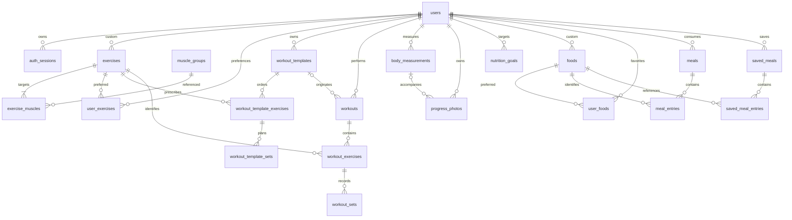

# Modelo relacional completo (proposta; implementação incremental)

Estado M5: identidade, biblioteca, planos e treinos implementados nas migrações 0001–0004. O restante modelo
continua proposta. Favoritos false removem a linha de user_exercises; o flag existe para
evoluir preferências sem duplicar exercícios. Catálogo/privados são diferenciados por owner_id.

Todas as entidades têm PK UUID, created_at/updated_at timestamptz, salvo tabelas de junção
com PK composta indicadas. FKs são indexadas quando usadas em joins/filtros. Numeric para
carga/medidas/macros; nunca float para persistência. Constraints CHECK de valores não negativos,
reps inteiras positivas quando concluídas, RIR inteiro 0–10 e posições >=0.

## V1

| Tabela | Campos e constraints principais |
|---|---|
| users | id, email (índice único lower(email)), password_hash, display_name, timezone, unit_system, weekly_workout_target >0 |
| auth_sessions | id, user_id FK, refresh_token_hash UNIQUE, family_id, expires_at, revoked_at, replaced_by_id FK nullable |
| muscle_groups | id, slug UNIQUE, name |
| exercises | id, owner_id FK users nullable = catálogo global, name, equipment, load_type, load_convention, instructions nullable, archived_at |
| exercise_muscles | exercise_id FK, muscle_group_id FK, role primary/secondary; PK (exercise_id,muscle_group_id), índice único parcial exercise_id WHERE role='primary' |
| user_exercises | user_id FK, exercise_id FK, is_favorite; PK (user_id,exercise_id) — preferências, não duplicação do exercício |
| workout_templates | id, user_id FK, name, version >0, archived_at |
| workout_template_exercises | id, template_id FK, exercise_id FK, position, rest_seconds >=0, notes; UNIQUE(template_id,position) |
| workout_template_sets | id, template_exercise_id FK, position, set_type, target_reps_min/max, target_weight_kg nullable, target_rir nullable; UNIQUE(template_exercise_id,position) |
| workouts | id (cliente), user_id FK, template_id FK nullable, create_hash, name_snapshot, status active/paused/completed/cancelled, started_at, finished_at nullable, paused_at nullable, paused_seconds >=0, rest_deadline nullable, notes, version |
| workout_exercises | id, workout_id FK, exercise_id FK, position, name_snapshot, load_type_snapshot, load_convention_snapshot, rest_seconds, notes; UNIQUE(workout_id,position) |
| workout_sets | id, workout_exercise_id FK, position, set_type warmup/working, weight_kg numeric(8,3) nullable, reps nullable, rir nullable, completed_at nullable; UNIQUE(workout_exercise_id,position) |
| workout_mutations | workout_id FK CASCADE, mutation_id; PK composta; payload_hash, applied_version — recibo de idempotência |

Um exercício pode repetir-se num template/sessão: não impor UNIQUE(workout_id,exercise_id).
A tabela de sets planeados é necessária para distinguir prescrição de resultado real.
Em M4, guardar substitui os filhos do plano numa única transação: os UUIDs dos exercícios
planeados/séries são internos e regenerados na edição; estes filhos não têm timestamps
próprios. `workout_templates.updated_at/version` identificam a revisão do agregado.
PUT e DELETE exigem a versão lida e usam lock de linha; uma versão antiga devolve 409.
Limites atuais: 40 exercícios por plano, 1–20 séries por exercício, descanso 0–3600 s,
reps 1–999 com máximo >= mínimo, carga numeric(8,3) opcional, RIR opcional 0–10.
Planos vazios são permitidos. Apagar arquiva e preserva filhos; não existe restauro na UI.
Não guardar is_custom: deriva de owner_id. Exigir exatamente um músculo primário no serviço
(índice parcial só garante no máximo um). Catálogo global é apenas editável pelo administrador.

Índices: workouts(user_id,started_at DESC,id), workout_templates(user_id),
exercises(owner_id,lower(name)), exercise_muscles(muscle_group_id,exercise_id),
auth_sessions(user_id,expires_at). Índice UNIQUE parcial workouts(user_id) WHERE status IN
('active','paused'). CHECK: completed exige finished_at >= started_at; completed_at num set
exige reps e weight válidos segundo load_type. Regras entre tabelas são validadas no serviço
dentro de transação. Posição reordenada atomicamente com UNIQUE deferrable.

PRs, duração ativa e volume são derivados de sets/sessões concluídos; sem tabela duplicada
de records inicialmente. Consultar record anterior excluindo a sessão atual. Para PRs recentes,
comparar cronologicamente com o máximo anterior. Materializar só após medir desempenho.

## V2 — progresso

| Tabela | Campos |
|---|---|
| body_measurements | id, user_id FK, measured_at, weight_kg numeric(6,3), waist_cm, chest_cm, arms_cm, legs_cm numeric(6,2), body_fat_percent numeric(5,2), notes; pelo menos uma medida; percentagem 0–100 |
| progress_photos | id, user_id FK, measurement_id FK nullable, object_key UNIQUE, taken_at, view front/side/back/other, notes |

Índice body_measurements(user_id,measured_at DESC,id) e progress_photos(user_id,taken_at).
Graphs, frequência, e1RM e volume consultam o histórico V1; sem tabela por gráfico.

## V3 — nutrição

| Tabela | Campos |
|---|---|
| nutrition_goals | id, user_id FK, effective_from date, calories, protein_g, carbs_g, fat_g; UNIQUE(user_id,effective_from) |
| foods | id, owner_id FK users nullable, name, brand nullable, serving_size numeric(9,3)>0, serving_unit, calories, protein_g, carbs_g, fat_g numeric(9,3), archived_at |
| user_foods | user_id FK, food_id FK, is_favorite; PK(user_id,food_id) |
| meals | id, user_id FK, date date, meal_type breakfast/lunch/dinner/snack/other, name nullable |
| meal_entries | id, meal_id FK, food_id FK, servings numeric(9,3)>0, food_name_snapshot, serving_size_snapshot, serving_unit_snapshot, calories_snapshot, protein_g_snapshot, carbs_g_snapshot, fat_g_snapshot |
| saved_meals | id, user_id FK, name |
| saved_meal_entries | id, saved_meal_id FK, food_id FK, servings >0, position; UNIQUE(saved_meal_id,position) |

Macros nos foods são por porção definida. Snapshot nas entries é também por porção;
totais = snapshot × servings. Meals representam refeições consumidas, saved_meals representam
templates; não usar a mesma entidade para ambos. Goals por data efetiva conservam objetivos
históricos; selecionar o último effective_from <= date. Índices meals(user_id,date,id),
foods(owner_id,lower(name)), saved_meals(user_id). Não armazenar totais diários duplicados.

## V4–V6

Recomendações/insights são resultados de serviços sobre dados existentes; não exigem novas
tabelas agora. Integrações, partilha e conversas AI terão schemas próprios quando contratos,
consentimento e retenção estiverem definidos. Não criar tabelas especulativas para essas APIs.

## Relações e eliminação

CASCADE para filhos exclusivos: template → exercícios → sets planeados; workout → exercícios
→ sets; meal → entries; saved_meal → entries; junções/favoritos/sessões de auth por utilizador.
SET NULL para workouts.template_id e progress_photos.measurement_id; snapshots preservam leitura.
RESTRICT para referências a exercises/foods/muscle_groups: arquivar em uso, não apagar.
FK owner_id em foods/exercises é RESTRICT para não transformar custom em catálogo global.
Account deletion é uma transação explícita: eliminar histórico/templates/favoritos/entries antes
de custom foods/exercises e user; relações diretas user-owned podem usar CASCADE, mas a ordem
de limpeza dos catálogos referenciados é explícita. Objetos de fotos têm remoção externa idempotente.

Todas as referências a recursos privados são verificadas contra o utilizador autenticado;
um UUID válido não dá acesso. Catálogos globais são legíveis, privados apenas pelo proprietário.
Testar referências cruzadas entre contas em M2–M6. Não aceitar user_id do corpo como autorização.
